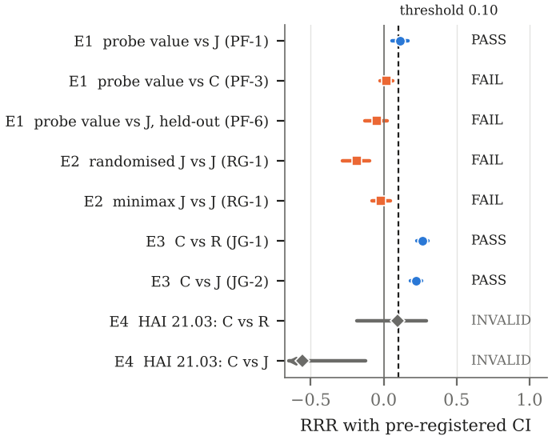

<div align="center">

# ⚔️ HADES

### What helps when telemetry lies?

**Pre-registered tests of budgeted evidence acquisition for threat hunting under source compromise**

[](https://www.python.org/)
[](./tests/)
[](#-the-four-experiments)
[](./paper/manuscript/main.pdf)
[](./pyproject.toml)

[Paper (PDF)](./paper/manuscript/main.pdf) ·
[Results](#-results-at-a-glance) ·
[Reproduce](#-reproduce) ·
[Repository map](#-repository-map) ·
[History](#-project-history)

</div>

---

## 🧭 The question

A threat hunter triaging an alert can afford to read only a few telemetry sources (EDR, Sysmon, auth, DNS, proxy,
NetFlow, cloud audit, mail gateway), and some of them may be controlled by the attacker
([ATT&CK T1562, *Impair Defenses*](https://attack.mitre.org/techniques/T1562/)). Which source should be read next, and
how far should it be believed?

New acquisition policies usually change several things at once and are tested against the attacker they were designed
for. HADES instead runs **controlled, pre-registered ablations**:

- every policy shares the same exact posterior over the hypothesis and every source's compromise state, the same
  Bayes terminal decision, and **exactly the same spend**;
- policies differ only in how they score the next action (look-ahead **model**, **objective**, horizon);
- each experiment fixes its comparators, a 10% relative-regret threshold and its gates in a committed protocol, and is
  scored on an **attacker written after the policies were frozen**.

> [!NOTE]
> The joint belief over hypothesis and source state is classical (GDE, decision-theoretic troubleshooting, Byzantine
> detection). The contribution is controlled evidence about *which part matters* and where it stops mattering, including
> two clean negative results. See the [novelty audit](./docs/hades2_novelty_audit.md).

---

## 📊 Results at a glance

| | Experiment | Idea tested | Primary result (RRR, 95% CI) | Verdict |
|:-:|---|---|---|:-:|
| **E1** | `phase7l_probe_pilot_v2` | Value integrity probes by their decision consequences | vs same-model H-info: 0.02 [−0.02, 0.06] | 🔴 **KILL** |
| **E2** | `phase7t_robust_pilot_v1` | Randomised / minimax acquisition | −0.19 and −0.02 on held-out attacker | 🔴 **KILL** |
| **E3** | `phase7u_joint_belief_v1` | Hypothesis info under a joint (H, S) model | 0.27 [0.23, 0.30] vs R · 0.22 [0.19, 0.26] vs J | 🟢 **PROCEED** |
| **E4** | `phase7v_hai_replication_v1` | E3 on real ICS data (HAI) | evidence did not beat the prior-only decision | ⚪ **INVALID** |

<p align="center">
  
</p>

**What survives.** In simulation, scoring evidence by information about the *incident* under a joint model of the
incident and each source's compromise state cuts regret on a held-out attacker by **27%** relative to
reliability-weighted information gain and **22%** relative to joint-state information gain.

**Where it stops.**
- The gain tracks how closely the attacker's lies match the defender's model: large for cover-up and decoy attackers,
  small for misattribution.
- Against an attacker that adapts to the hunter's queries, it survives only relative to reliability weighting, and
  **random acquisition is the best policy** in every simulated experiment.
- The real-data attempt on HAI was **invalid** by its own pre-registered check, so the positive result is
  **simulator-only**.

<details>
<summary><b>The policies</b></summary>

| Label | Policy | Look-ahead model | Objective |
|:-:|---|---|---|
| **C** | `P_JOINT_HEIG_COST` | exact joint P(H, S) | entropy of H |
| **R** | `P3_RHAT_COST_LA2` | reliability-weighted (r̂·nominal + (1−r̂)·uniform) | entropy of H |
| **J** | `P_JOINT_EIG_COST` | exact joint P(H, S) | entropy of (H, S), the GDE criterion |
| **P** | `P_PROBE` | exact joint P(H, S) | decision value (VoI) |

All four use a 2-step horizon and divide by cost. References: random (`P0_RANDOM_COST_MATCHED`), cost-blind nominal
EIG (`P3_NOM`), and in E2 two robust wrappers of J (`P_RAND_JEIG`, `P_MINIMAX_JEIG`).

</details>

<details>
<summary><b>The attackers</b></summary>

Five procedurally parameterised families, three of them each held out from one experiment's design:
**cover-up** (design), **misattribution** (held out in E1), **trust-harvest** (adaptive), **decoy-migrate** (held out
in E2), **collude-cheap** (held out in E3). Worlds are drawn from a frozen distribution; no world, attacker or
threshold is hand-tuned after a run.

</details>

---

## 🧪 The four experiments

Each experiment has a protocol, a gate file and a report, all committed before (protocol, gates) or after (report) the
run. Runners refuse a dirty tree, a changed config or an existing output.

| | Protocol | Gates | Report | Status file |
|:-:|---|---|---|---|
| E1 | [protocol](./docs/phase7g_probe_value_falsification_protocol.md) | [gates](./docs/hades2_kill_gates.md) | [kill report](./docs/hades2_probe_kill_report.md) | [`STATUS_HADES2_PROBE_KILLED.md`](./STATUS_HADES2_PROBE_KILLED.md) |
| E2 | [protocol](./docs/phase7t_robust_acquisition_protocol.md) | [gates](./docs/phase7t_robust_acquisition_gates.md) | [kill report](./docs/phase7t_robust_kill_report.md) | [`STATUS_HADES2_ROBUST_KILLED.md`](./STATUS_HADES2_ROBUST_KILLED.md) |
| E3 | [protocol](./docs/phase7u_joint_belief_protocol.md) | [gates](./docs/phase7u_joint_belief_gates.md) | [report](./docs/phase7u_joint_belief_report.md) | — |
| E4 | [protocol](./docs/phase7v_hai_replication_protocol.md) | [gates](./docs/phase7v_hai_replication_gates.md) | [report](./docs/phase7v_hai_replication_report.md) | [`STATUS_HADES2_HAI_INVALID.md`](./STATUS_HADES2_HAI_INVALID.md) |

**Statistics.** Relative regret reduction `RRR = 1 − Σ ȳ(X) / Σ ȳ(Y)` over worlds; percentile paired bootstrap
(10,000 resamples); a gate passes only if RRR ≥ 0.10 **and** the interval's lower end is above 0. World counts come from
a blinded power calibration on separate seeds.

| Seeds | Range |
|---|---|
| dev / tests | 0–99 |
| E1 calibration · pilot | 900000–900039 · from 1000000 |
| E2 calibration · pilot | 910000–910039 · from 2000000 |
| E3 calibration · pilot | 920000–920039 · from 3000000 |

---

## 📄 Paper

[`paper/manuscript/main.pdf`](./paper/manuscript/main.pdf): *What Helps When Telemetry Lies? Four Pre-Registered
Tests of Evidence Acquisition under Source Compromise* (IEEEtran, draft v2).

- Every number is a macro generated from the raw outputs; none is typed by hand.
- Revised after three simulated hostile reviews: [reviews](./docs/paper_review/reviews.md) ·
  [response](./docs/paper_review/response_and_revisions.md) ·
  [citation check](./docs/paper_review/citation_check.md) ·
  [Stage 7 verdict](./docs/paper_stage7_verdict.md) (🟡 proceed after fixes).

```
results/raw/*.json(.gz) ──► scripts/paper/recompute_headlines.py ──► results/processed/paper_numbers.json
                                   (18/18 checks vs committed statistics)          │
                                                                                   ▼
paper/manuscript/main.pdf ◄── pdflatex ◄── tables/numbers.tex, figures/ ◄── scripts/paper/make_figures.py
```

---

## 🚀 Reproduce

> [!TIP]
> On Windows use `py` (the `python` alias resolves to the Store stub). On Linux/macOS use `python3`.

```powershell
git clone https://github.com/ftaakash/Hades.git
cd Hades
py -m pip install -e .

# Full test suite (468 tests)
py -m pytest tests/ -q

# Recompute every paper number from raw results, then rebuild figures, tables and the PDF
py scripts/paper/recompute_headlines.py
py scripts/paper/make_figures.py
cd paper/manuscript; pdflatex main; bibtex main; pdflatex main; pdflatex main
```

<details>
<summary><b>Re-running the experiments</b> (refuses to overwrite committed results)</summary>

Each runner writes a calibration manifest once, then the pilot, then a verdict that cannot be overwritten.
Re-running needs a fresh clone without the committed outputs, or a new experiment ID.

```powershell
# E1: probe value
py scripts/run_probe_pilot.py calibration
py scripts/run_probe_pilot.py pilot
py scripts/analyze_probe_pilot.py

# E2: robust acquisition
py scripts/run_robust_pilot.py calibration
py scripts/run_robust_pilot.py pilot
py scripts/analyze_robust_pilot.py

# E3: joint belief
py scripts/run_joint_pilot.py calibration
py scripts/run_joint_pilot.py pilot
py scripts/analyze_joint_pilot.py

# E4: HAI replication (needs HAI 20.07 / 21.03 / 22.04, see below)
py scripts/run_hai_replication.py
py scripts/analyze_hai_replication.py
```

HAI is not redistributed here. Download it from [icsdataset/hai](https://github.com/icsdataset/hai) (CC BY-SA 4.0);
the runner records the SHA-256 of every file it reads.

</details>

---

## 🗂️ Repository map

```
hades/
├── probe_experiment/      HADES 2.0: everything behind E1–E4
│   ├── world.py           procedural world distribution
│   ├── attacker.py        cover-up, misattribution, trust-harvest attackers
│   ├── belief.py          exact joint posterior P(H, S | E)
│   ├── policies.py        C, R, J, P and references
│   ├── robust.py          randomised / minimax wrappers + decoy-migrate attacker (E2)
│   ├── joint_confirm.py   collude-cheap attacker (E3)
│   ├── simulator.py       spend-matched episodes, common random numbers
│   ├── *_eval.py          frozen gate code per experiment
│   └── hai*.py            HAI episodes, fitted defender model (E4)
├── belief/ policies/ simulator/ corruption/ reliability/ benchmark/ ...   HADES 1.0 (frozen)
scripts/
├── run_*_pilot.py, analyze_*_pilot.py     experiment runners and gate analysis
├── run_hai_replication.py, analyze_hai_replication.py
└── paper/                 recompute_headlines.py, make_figures.py
configs/experiments/       frozen JSON/YAML configs, one per experiment ID
results/
├── raw/                   immutable run outputs (+ seed manifests)
├── analysis/              statistics and verdict JSON
└── processed/             paper_numbers.json
docs/                      protocols, gates, reports, novelty audit, paper review
paper/manuscript/          main.tex, refs.bib, figures/, tables/
tests/                     468 tests, including leakage and spend-matching checks
```

---

## 🕰️ Project history

<details>
<summary><b>HADES 1.0</b>: robust value of information (frozen at tag <code>hades-1.0-final</code>)</summary>

HADES 1.0 tested a robust value-of-information policy (P5) with a contaminated likelihood
`p(e | H, q) = r̂·p_nominal + (1 − r̂)·p_noise`, against a cited policy ladder (P0 random … P4b r̂-weighted EIG/cost),
corruption regimes R0–R4 and reliability-estimator regimes.

| Finding | Outcome |
|---|---|
| P5 broad superiority | 🔴 killed |
| Cost-awareness effect | 🟢 supported |
| Reliability increment | 🟡 narrow / small |
| Manipulation-risk (φ) channel | active, not supportive |
| Public CDB sample transfer | 🔴 killed ([record](./STATUS_CDB_SAMPLE_KILLED.md)) |
| Full CDB evaluation | ⏳ deferred ([plan](./docs/future/cdb_full_access_plan.md)) |

Details: [`STATUS_HADES1_FROZEN.md`](./STATUS_HADES1_FROZEN.md) ·
[`docs/phase7d_hades1_status.md`](./docs/phase7d_hades1_status.md) · [`docs/REFRAME.md`](./docs/REFRAME.md).
HADES 1.0 code and results are not modified; corrections need a new experiment ID.

</details>

```
HADES 1.0 (P5 robust VoI) ──frozen──► HADES 2.0 ─┬─ E1 probe value ............ KILL
                                                  ├─ E2 robust acquisition ..... KILL
                                                  ├─ E3 joint belief ........... PROCEED (simulator-only)
                                                  ├─ E4 HAI replication ........ INVALID
                                                  └─ Paper draft v2 ............ proceed after fixes
```

---

## 🔒 Ground rules

- Never fabricate results, never rewrite a failed gate as a pass, never hand-tune worlds after a run.
- Policies read only estimated quantities; ground truth is evaluator-only and leakage tests enforce it.
- Beliefs are validated to sum to 1 at every step; ties break deterministically.
- Every claim traces: **claim → figure/table → script → processed data → raw run → config → seed → git commit**.
- Corrections to committed reports are dated errata, never silent edits.

---

## 📚 Citation

```bibtex
@misc{gs2026hades,
  author = {G.S., Aakash},
  title  = {What Helps When Telemetry Lies? Four Pre-Registered Tests of
            Evidence Acquisition under Source Compromise},
  year   = {2026},
  note   = {Draft. Code and data: https://github.com/ftaakash/Hades}
}
```

See also [`CITATION.cff`](./CITATION.cff). If you use the HAI results, please also cite the HAI dataset (Shin et al.,
CSET 2020 and 2021).

---

<div align="center">

*Research prototype, not a production tool. The positive result is simulator-only; no claim of robustness to adaptive
attackers is made.*

**Researcher:** Aakash G.S. · gsaakash@outlook.com

</div>
